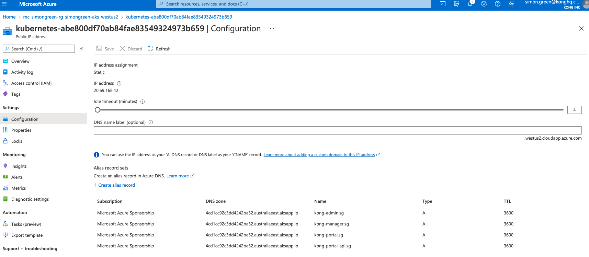

Installing Kong Gateway on Azure AKS with Terraform
===========================================================

This example stands up a simple Azure AKS cluster, then provides a procedure to install postgres and Kong Gateway Enterprise.  It also makes use of Kong Ingress Controller to proxy requests in through a single loadbalancer, which is best practice.  Lastly, it enables BasicAuth RBAC for Kong Manager and Developer Portal.

## Prerequisites
1. AKS Credentials (App ID and Password)
2. Terraform CLI
3. Azure CLI
4. AKS Domain name

## Procedure

1. Open `/tf-provision-aks/aks-cluster.tf` to search & replace `simongreen` with your own name.  That way, all AKS objects will be tagged with your name making them easily searchable. Also, update the Azure region in this file to the region of your choice.
2. If you haven't done so already, create an Active Directory service principal account via the CLI:

 ```bash
 az login
 az ad sp create-for-rbac --skip-assignment`.  # This will give you the `appId` and `password` that Terraform requires to provision AKS.
 ```

3.  In `/tf-provision/aks` directory, create a file called `terraform.tfvars`.  Enter the following text, using your credentials from the previous command:

```bash
appId    = "******"
password = "******"
```

4. Search and replace 'simongreen' for a unique tag in the `/tf-provision-aks/aks-cluster.tf` file.
5. Via the CLI, `cd tf-provision-aks/` then run the following Terraform commands to provisions AKS:

```bash
terraform init
terraform apply
```

6. Once terraform has stoodup AKS, setup `kubectl` to point to your new AKS instance:

```bash
az aks get-credentials --resource-group $(terraform output -raw resource_group_name) --name $(terraform output -raw kubernetes_cluster_name)
kubectl get all
```

## Install Kong

1. Update license under ./license/license of this directory.
2. Update the following in values-dns.yaml or values-lb.yml file. For DNS, I used an existing DNS record found via the Azure web interface, and created an Alias record set on the public IP that gets created through this process.



For DNS, change with your hostname:

- Admin: https://kong-admin.CHANGE-ME.com
- Manager: https://kong-manager.CHANGE-ME.com
- Portal API: https://kong-portal-api.CHANGE-ME.com
- Portal: kong-portal.CHANGE-ME.com

For LB, change with your hostname but make sure you preserve the port number:

- Admin: https://kong-admin.CHANGE-ME.com:8001
- Manager: https://kong-manager.CHANGE-ME.com:8002
- Portal API: https://kong-portal-api.CHANGE-ME.com:8004
- Portal: kong-portal.CHANGE-ME.com:8003

It is best to do a search on CHANGE-ME.com and replace all occurrences with your DNS name

### Install

1. Create namespace

`kubectl create namespace kong`

2. Create license secret

`kubectl create secret generic kong-enterprise-license -n kong --from-file=./license/license`

3. Create RBAC user:

`kubectl create secret generic kong-enterprise-superuser-password -n kong --from-literal=password=kong`

4. Create session configurations, Make sure to change "cookie_domain" in each:

```bash
echo '{"cookie_name":"admin_session","cookie_domain": ".CHANGE-ME.com","cookie_samesite":"off","secret":"password","cookie_secure":false,"storage":"kong"}' > admin_gui_session_conf

echo '{"cookie_name":"portal_session","cookie_domain": ".CHANGE-ME.com","cookie_samesite":"off","secret":"password","cookie_secure":false,"storage":"kong"}' > portal_session_conf
```

Using the following command to create the secrets

`kubectl create secret generic kong-session-config -n kong --from-file=admin_gui_session_conf --from-file=portal_session_conf`

5. Remove files:

`rm portal_session_conf admin_gui_session_conf`

6. Add kong charts repo:

`helm repo add kong https://charts.konghq.com`

and

`helm repo update`

7. Option 1: Install kong with DNS and KIC:

`helm install kong kong/kong -n kong --values ./values/values-dns.yml`

if you wanted to upgrade:

`helm upgrade kong kong/kong -n kong --values ./values/values-dns.yml`

8. Option 2: Install kong using Azure NLB and no KIC:

`helm install kong kong/kong -n kong --values ./values/values-lb.yml`

if you wanted to upgrade:

`helm upgrade kong kong/kong -n kong --values ./values/values-lb.yml`

9. Option 3: Install kong using Nginx ingress controller and KIC, using a single domain:

`helm install kong kong/kong -n kong --values ./values/values-single-domain.yml`

if you wanted to upgrade:

`helm upgrade kong kong/kong -n kong --values ./values/values-single-domain.yml`

Once the helm chart is installed, manually install the KIC ingress rule in the `kong` namespace:

`kubectl apply -f values/kong-admin-ingress.yaml -n kong`

10. Monitor:

`kubectl get po -n kong -w `

### Option 1: DNS Post install:

1. Run `kubectl get ing -n kong`, it will return:

```NAME                  CLASS    HOSTS                                                      ADDRESS       PORTS     AGE
kong-kong-admin       <none>   kong-admin.kong-changeme.kong-sales-engineering.com        35.226.56.8   80, 443   91s
kong-kong-manager     <none>   kong-manager.kong-changeme.kong-sales-engineering.com      35.226.56.8   80, 443   91s
kong-kong-portal      <none>   kong-portal.kong-changeme.kong-sales-engineering.com       35.226.56.8   80, 443   91s
kong-kong-portalapi   <none>   kong-portal-api.kong-changeme.kong-sales-engineering.com   35.226.56.8   80, 443   91s
```

2. Update DNS in provider pointing to load balancer IP in your cloud account

### Option 2: NLB Post install:

1. Check services:

`kubectl get svc -n kong -w`

2. You should have somethign similiar to:

```kong-kong-admin            LoadBalancer   10.11.244.9     35.238.46.234    8001:32270/TCP,8444:30125/TCP   3m3s
kong-kong-manager          LoadBalancer   10.11.241.44    34.71.241.10     8002:32319/TCP,8445:30608/TCP   3m3s
kong-kong-portal           LoadBalancer   10.11.241.141   35.222.124.219   8003:31487/TCP,8446:30767/TCP   3m3s
kong-kong-portalapi        LoadBalancer   10.11.246.45    35.239.109.87    8004:30957/TCP,8447:32316/TCP   3m3s
kong-kong-proxy            LoadBalancer   10.11.254.230   35.239.109.90        80:31209/TCP,443:32489/TCP      3m3s
```

3. Let's make sure we can call all these endpoints:

- curl 35.238.46.234:8001
- Got to http://34.71.241.10:8002/overview
- curl 35.222.124.219:8003
- curl 35.239.109.87:8004

4. Via the Azure UI, update each static IP (found in the resource groups) and add a suitable DNS label e.g. `kong-admin` matching 35.238.46.234 for example.

***
